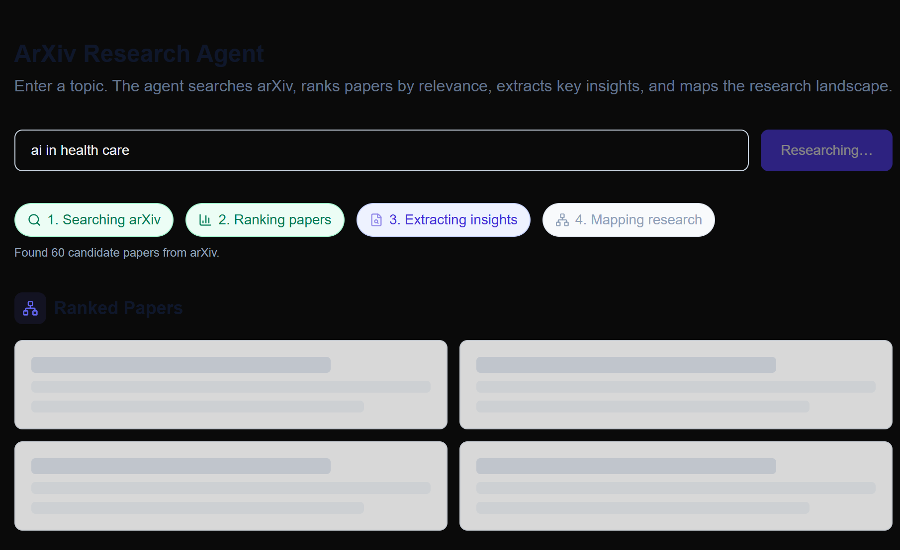
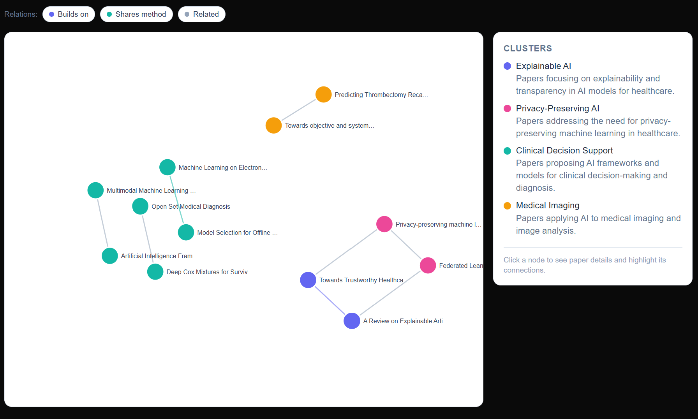
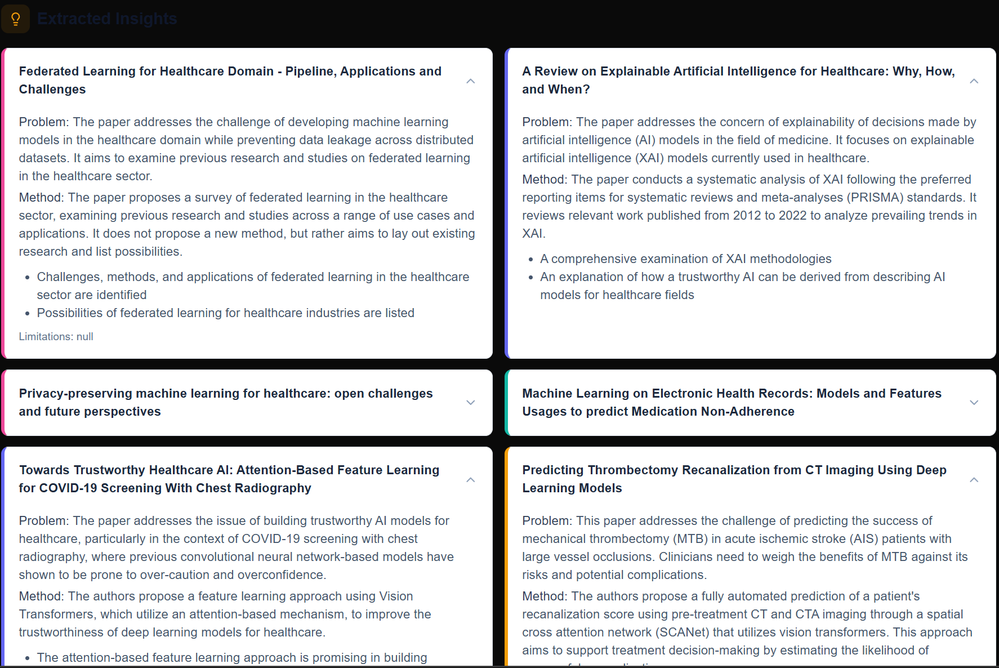

# ArXiv Atlas

An AI research agent that turns a topic into a visual map of its research
landscape — it searches arXiv, ranks papers by relevance, extracts
structured insights per paper, and synthesizes the results into an
interactive graph of clusters, relationships, and open problems.







## Why this exists

Most "AI research assistant" demos are a thin wrapper: one prompt, one
summary. That's fast to build and not very useful — it gives you a
paragraph, not an understanding of a field. ArXiv Atlas is an attempt at
something closer to how an actual literature review works: find a wide net
of candidates, narrow them down with two different relevance signals, pull
out comparable structured facts per paper, then look across all of them to
find the actual shape of the field — what approaches exist, how they relate,
and what's still unsolved.

## How it works

```
topic
  │
  ▼
1. Find papers     LLM expands the topic into several arXiv search queries
                    (arXiv's search is keyword-based, so a single query
                    misses a lot — expansion improves recall), results
                    deduplicated into a candidate pool.
  │
  ▼
2. Rank papers      Local cross-encoder scores topic-vs-abstract relevance
                    for every candidate (fast, cheap, no API cost) →
                    shortlist. The shortlist then gets a finer LLM relevance
                    score (0-100) + a one-line justification.
  │
  ▼
3. Extract insights  Each paper is sent to the LLM individually with a fixed
                    schema: problem, method, key results, datasets,
                    limitations. Papers that fail extraction are dropped and
                    backfilled from further down the ranked list — not
                    retried — so a single bad call never wastes a slot.
  │
  ▼
4. Map research     The structured extractions (not raw papers) are sent to
                    the LLM, which clusters papers thematically and outputs
                    a graph: nodes, typed edges (builds_on / contradicts /
                    shares_method / shares_dataset / related), clusters, and
                    open problems.
  │
  ▼
interactive D3 force-directed graph + ranked list + insight cards
```

All four stages stream to the frontend via Server-Sent Events, so the UI
shows live per-stage progress instead of one long blocking spinner.

## Design decisions worth noting

- **Two-pass ranking, not one.** A cross-encoder alone is fast but shallow;
  an LLM alone over 60 candidates is slow and expensive. Running the cheap
  model first to cut the pool, then the LLM only on the shortlist, gets most
  of the quality at a fraction of the cost.
- **Skip-and-backfill instead of retry.** If extraction fails on a paper
  (rate limit, transient error), retrying the same call rarely helps and
  burns quota. Pulling the next-ranked paper instead keeps the final set at
  full size without hammering a call that's likely to fail again.
- **Caching at every LLM call site.** Query expansion, relevance scoring,
  extraction, and synthesis are all cached (extraction is cached
  permanently per `arxiv_id`, since an abstract never changes; the rest are
  cached per exact input set with a TTL). Re-running the same topic — or a
  different topic that happens to surface an already-seen paper — costs
  close to zero extra API calls.
- **Graceful degradation over hard failure.** If the final synthesis call
  fails (e.g. quota exhausted), the pipeline doesn't crash — it returns the
  papers and insights that already succeeded, with an unclustered fallback
  map and a clear message, instead of an opaque 500 or a dead SSE stream.

## Tech stack

**Backend:** FastAPI, Groq API (`llama-3.3-70b-versatile`) for reranking/
extraction/synthesis, `sentence-transformers` (`ms-marco-MiniLM-L-6-v2`) for
local cross-encoder reranking, `arxiv` for search.

**Frontend:** Next.js, Tailwind CSS, D3.js for the force-directed graph,
`lucide-react` for icons.

## Project structure

```
arxiv-research-agent/
├── backend/
│   └── app/
│       ├── main.py              # FastAPI entrypoint
│       ├── config.py            # env-based settings
│       ├── pipeline.py          # orchestrates all 4 stages
│       ├── models/schemas.py    # Pydantic models shared across stages
│       ├── routers/research.py  # /api/research and /api/research/stream
│       └── services/
│           ├── groq_client.py   # Groq chat/JSON wrapper
│           ├── cache.py         # disk-based cache for LLM calls
│           ├── arxiv_search.py  # stage 1
│           ├── reranker.py      # stage 2
│           ├── extraction.py    # stage 3 + skip-and-backfill
│           └── synthesis.py     # stage 4
└── frontend/
    └── src/
        ├── app/page.tsx              # main page, wires stages + UI
        ├── components/
        │   ├── ResearchGraph.tsx     # D3 force-directed graph, filters, highlight-on-click
        │   ├── StageProgress.tsx     # pipeline progress
        │   ├── PaperList.tsx / InsightsList.tsx
        │   └── Skeletons.tsx         # loading states per stage
        ├── lib/api.ts                # SSE streaming client
        └── types/research.ts         # TS types mirroring backend schemas
```

## Running locally

**Backend:**
```bash
cd backend
python -m venv venv && venv\Scripts\activate   # Windows
pip install -r requirements.txt
copy .env.example .env   # then set GROQ_API_KEY (free at console.groq.com)
uvicorn app.main:app --reload --port 8000
```

**Frontend:**
```bash
cd frontend
npm install
copy .env.local.example .env.local
npm run dev
```

Open `http://localhost:3000`. First backend request will be slower than
usual — the cross-encoder model downloads on first use (~100MB, cached
after).

## Known limitations

- Extraction works on abstracts only, not full paper text — abstracts omit
  a lot of nuance (exact limitations, precise dataset details).
- Ranking is purely textual; no citation/impact signal is factored in, so a
  well-cited foundational paper and an obscure textually-similar one can
  rank similarly.
- No persistence — every search re-runs the full pipeline (subject to
  caching); there's no history of past searches.
- Groq's free tier has a daily token quota, which a handful of test runs
  can exhaust.

## Roadmap

- Full-text extraction via ar5iv HTML instead of abstract-only.
- Citation-aware ranking via the Semantic Scholar API.
- MMR diversity reranking so the final paper set spans sub-approaches
  instead of clustering around one phrasing of the topic.
- Persisted research history (SQLite) so past topic searches don't need to
  re-run the full pipeline.